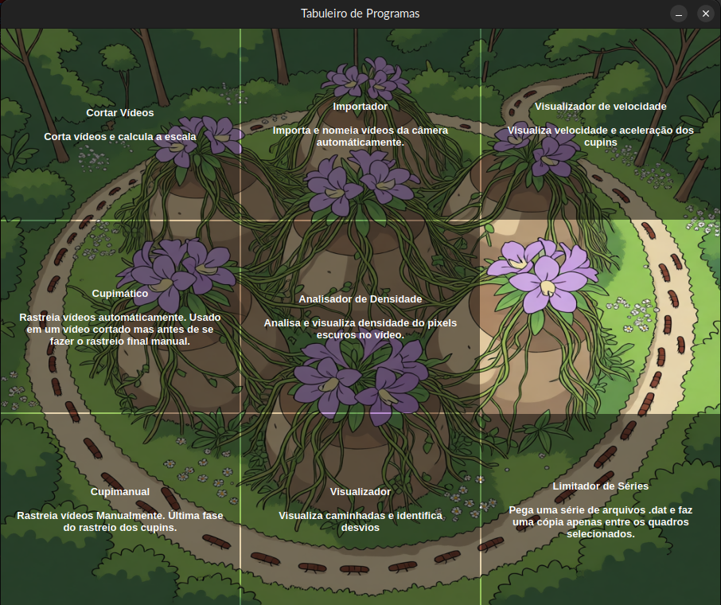
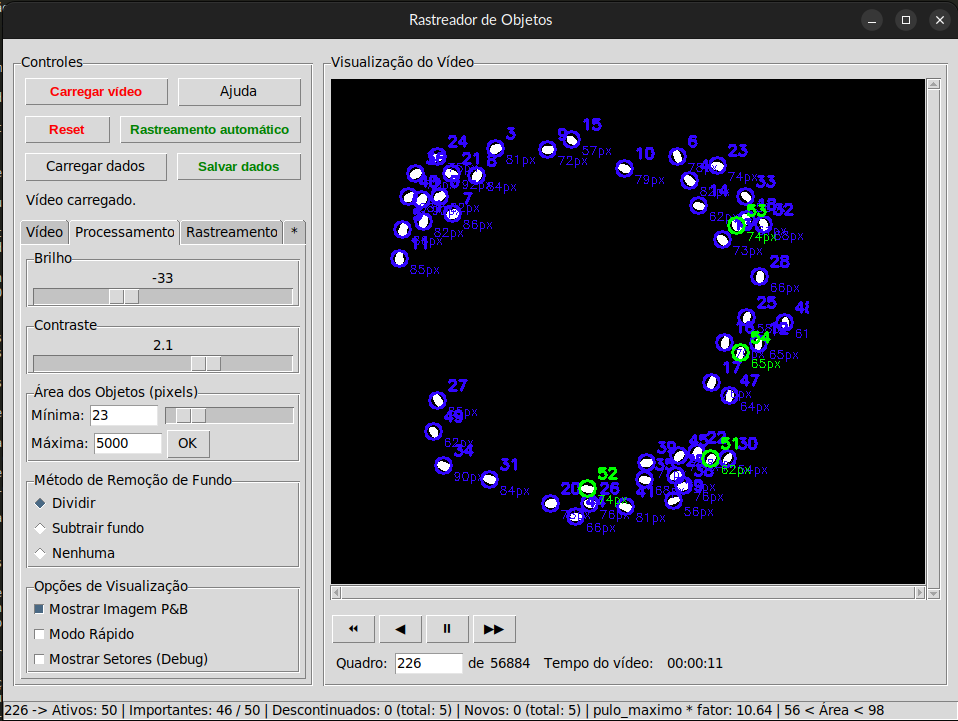
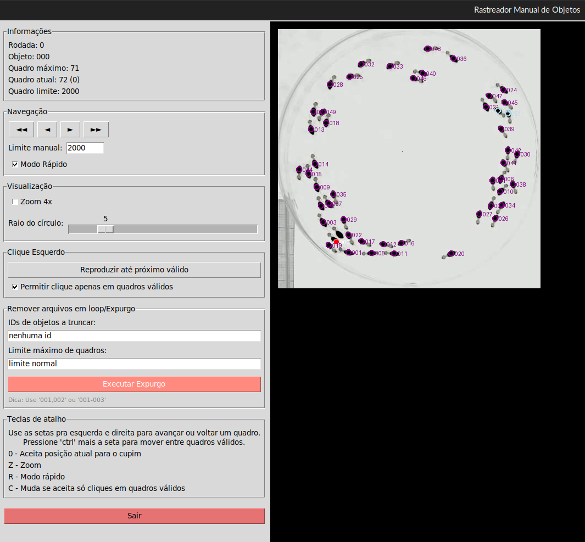

# Cupimático

## Resumo
O rastreador é dividido em duas partes, uma que faz o rastreamento de forma automática, sem preocupação em perder ou ganhar novos pontos de rastreio desde que não embaralhe eles, e um rastreador manual para ligar os rastreamentos dos cupins iniciais às trilhas de rastreio que aparecem e desaparecem depois, incluindo permitir clicar onde há cupins que não foram identicados pelo rastreador automático.

## Objetivo
Rastrear cupins por longos períodos de tempo (cerca de uma hora) sem inverter o rastreio de um cupim para outro

## Imagens

## Estado
- Projeto em desenvolvimento - Artigo científico em preparação

## Autor
Raul R.